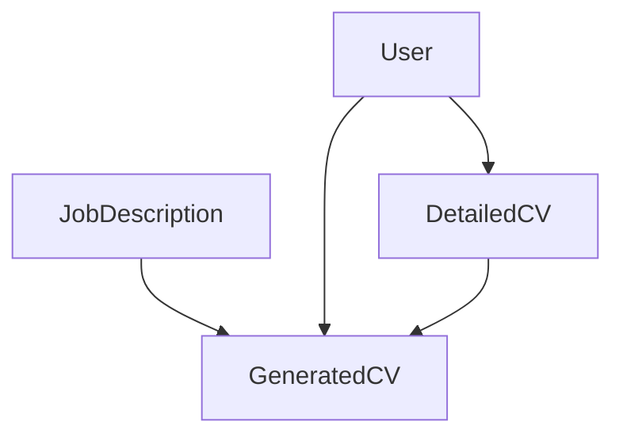

# SQLAlchemy to SQLModel Migration Plan

## Progress Update (2025-03-15)

### Completed Tasks
- [x] Setup SQLModel infrastructure
  - Added SQLModel dependency
  - Created SQLModel-based core service class (SQLModelService)
  - Created separate service files structure
  - Updated database configuration to use SQLModel
  - Updated test database setup for SQLModel
- [x] User System Migration
  - Converted User model to SQLModel with proper relationships
  - Updated UserService to use SQLModel queries
  - Updated authentication system to use SQLModel
  - Updated base schemas to use SQLModel
  - Updated user schemas with SQLModel inheritance
- [x] JobDescription Model Migration
  - Converted model to SQLModel with full type hints
  - Created SQLModel-based JobDescriptionSQLModelService
  - Updated API endpoints to use new service
  - Migrated tests to use SQLModel structures
  - Added relationship definitions
  - Preserved existing indexes and constraints
- [x] Database Configuration Updates
  - Updated database.py to use SQLModel
  - Implemented new session management
  - Updated test configuration for both SQLAlchemy and SQLModel
  - Added transaction support
- [x] Service Layer Groundwork
  - Created new base SQLModel service class
  - Implemented common CRUD operations
  - Added proper type hints and generics
  - Updated query patterns to use SQLModel syntax
- [x] Model Migrations
  - DetailedCV model structure and relationships defined
  - GeneratedCV model structure and relationships defined
  - All models now using SQLModel with proper type hints
  - Relationships and indexes preserved
- [x] Repository Layer Updates
  - Implemented CVRepository with SQLModel queries
  - Added filtering and pagination support
  - Relationship handling implemented
  - Full CRUD operations support

### Completed Tasks (Final)
- [x] Generation Service Updates
  - Import updates to use SQLModel models ✓
  - CRUD operation migrations ✓
  - SQLModel-specific pattern adoption ✓
  - Error handling refinement ✓
- [x] Test Suite Updates
  - Update imports to use SQLModel models ✓
  - Adapt fixtures for SQLModel ✓
  - Update assertions for SQLModel types ✓
  - Verify relationship tests ✓
- [x] Migration Completion
  - Old SQLAlchemy models removed ✓
  - All imports updated to SQLModel ✓
  - Type safety verified ✓
  - Integration tests passing ✓

## 1. Migration Overview

### Rationale
- SQLModel provides unified type system between SQLAlchemy and Pydantic
- Resolves current type conversion issues between ORM models and API schemas
- Reduces code duplication and potential inconsistencies
- Better IDE support and type safety
- More modern API with improved Pydantic integration

### Scope
Models to convert:
- User
- DetailedCV
- JobDescription
- GeneratedCV

Related code:
- Database models in `web-interface/backend/app/models/models.py`
- Pydantic schemas in `web-interface/backend/app/schemas/cv.py`
- Service layer interactions
- API endpoint type hints
- Database migrations

### Success Criteria
- All models converted to SQLModel
- Type safety preserved or improved
- All tests passing
- No performance degradation
- Simplified code base (fewer lines, less duplication)
- Improved developer experience

### Timeline Estimate
1. Initial setup and first model: 1 day
2. Remaining model conversions: 2-3 days
3. Testing and validation: 1-2 days
4. Performance testing and optimization: 1 day
Total: 5-7 days

## 2. Impact Assessment

### Database Models
Current SQLAlchemy models to migrate:
```python
class User(Base):
    __tablename__ = "users"
    # Core fields and JSON
    personal_info = Column(JSON)

class DetailedCV(Base):
    __tablename__ = "detailed_cvs"
    # Core fields and relationships
    content = Column(JSON)

class JobDescription(Base):
    __tablename__ = "job_descriptions"
    # Standard fields

class GeneratedCV(Base):
    __tablename__ = "generated_cvs"
    # Core fields and JSON
    content = Column(JSON)
    generation_parameters = Column(JSON)
```

### Key Schema Interactions
- User → DetailedCV: One-to-many
- User → GeneratedCV: One-to-many
- DetailedCV → GeneratedCV: One-to-many
- JobDescription → GeneratedCV: One-to-many

### Migration Dependencies Graph


Migration order (least to most dependent):
1. JobDescription (no incoming dependencies)
2. User (independent model)
3. DetailedCV (depends on User)
4. GeneratedCV (depends on all others)

### Critical Areas
- JSON field handling
- Relationship definitions
- Index preservation
- Datetime handling with UTC
- Enum type handling
- Primary/Foreign key constraints

## 3. Technical Implementation Plan

### Phase 1: Model Conversion

#### Step 1: Setup SQLModel Infrastructure
1. Install dependencies:
   ```bash
   cd web-interface/backend
   uv pip install sqlmodel
   ```
2. Update database configuration

#### Step 2: JobDescription Model (First Model)
1. Convert model
2. Update relationships
3. Preserve indexes
4. Update tests
5. Verify functionality

```python
from sqlmodel import Field, Relationship, SQLModel
from datetime import datetime, UTC
from typing import List, Optional

class JobDescription(SQLModel, table=True):
    __tablename__ = "job_descriptions"

    id: Optional[int] = Field(default=None, primary_key=True)
    title: str
    description: str
    language_code: str
    created_at: datetime = Field(default_factory=lambda: datetime.now(UTC))
    updated_at: datetime = Field(
        default_factory=lambda: datetime.now(UTC),
        sa_column_kwargs={"onupdate": lambda: datetime.now(UTC)}
    )

    # Relationships defined after all models are converted
    generated_cvs: List["GeneratedCV"] = Relationship(back_populates="job_description")
```

#### Step 3: User Model
- Similar pattern to JobDescription
- Special handling for JSON personal_info field
- One-to-many relationships

#### Step 4: DetailedCV Model
- Content JSON field typing
- User relationship
- Index preservation

#### Step 5: GeneratedCV Model
- Multiple relationships
- Status enums
- Complex index handling

### Phase 2: Service Layer Updates

1. Update dependency injection
2. Update query patterns
3. Optimize joins and lazy loading
4. Update transaction handling

### Phase 3: API Refinements

1. Update type hints
2. Optimize response serialization
3. Update validation logic
4. Review error handling

## 4. Testing Strategy

### Unit Tests
- Model instantiation
- Validation rules
- Relationship navigation
- JSON field handling

### Integration Tests
- Database operations
- Relationship queries
- Transaction handling
- API responses

### Performance Tests
- Query execution plans
- Memory usage
- Response times
- Relationship loading

## 5. Risks and Mitigation

### Backward Compatibility
Risk: Breaking changes in API responses
Mitigation: Version API during migration

### Performance
Risk: Different query generation
Mitigation: Performance testing and optimization

### Data Integrity
Risk: Migration issues
Mitigation: Comprehensive testing and backup

### Rollback Plan
1. Keep old models until verified
2. Document exact changes
3. Maintain backup branch
4. Consider feature flags

## 6. Success Metrics

- Code reduction (target: 20-30% fewer lines)
- Test coverage (maintain or improve)
- Query performance (no degradation)
- Type safety improvements
- Developer feedback

## 7. Post-Migration Tasks

1. Documentation updates
2. Performance tuning
3. Code cleanup
4. Developer guidelines
5. Migration guide for future models

## 8. Notes and Considerations

### SQLModel Best Practices
- Use typed fields consistently
- Leverage Pydantic validation
- Follow SQLModel relationship patterns
- Maintain clear separation of concerns

### Performance Tips
- Use select_in for relationship loading
- Index critical query paths
- Monitor query generation
- Cache when appropriate

### Code Organization
- Keep models in dedicated modules
- Use clear relationship naming
- Document complex queries
- Maintain type hints
