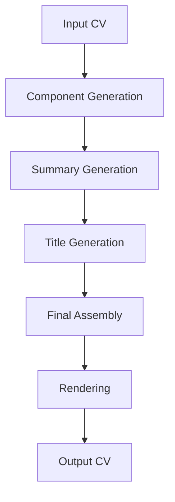
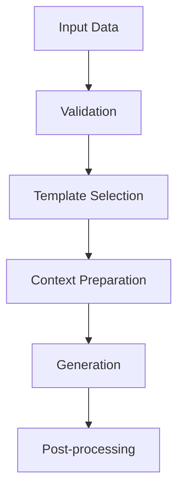

# Architecture Overview

This document explains the architectural design of CV Adapt, its core components, and how they work together to provide a flexible and extensible CV generation system.

## High-Level Architecture

CV Adapt follows a modular, layered architecture with clear separation of concerns:

```
┌────────────────────────────────────────────────────┐
│                 Application Layer                  │
│          (CVAdapterApplication, Core Logic)        │
├─────────────┬─────────────────────────┬────────────┤
│   Models    │       Services          │  Renderers │
│  (Domain)   │    (Business Logic)     │  (Output)  │
└─────────────┴─────────────────────────┴────────────┘
```

### 1. Application Layer

The application layer orchestrates the CV generation workflow:

1. Component Generation
   - Core competences
   - Experiences
   - Education
   - Skills
2. Summary Generation
   - Creates minimal CV
   - Generates professional summary
3. Title Generation
   - Generates professional title
4. Final CV Assembly
   - Combines all components
   - Applies rendering

### 2. Models Layer

The models layer defines the domain entities and ensures data integrity using Pydantic:

- **Personal Information**
  - Basic contact details
  - Location information
  - Professional metadata

- **Language Support**
  - Language enumeration
  - Context management
  - Validation rules

- **CV Components**
  - Title
  - Summary
  - Experience
  - Education
  - Skills

### 3. Services Layer

The services layer contains the business logic for CV generation:

- **Generator Services**
  - Component-specific generators
  - Template-based generation
  - Language-aware processing

- **Generator Protocol**
  - Universal interface
  - Type-safe generation
  - Flexible context handling

### 4. Renderers Layer

The renderers layer handles output generation:

- **Base Renderer**
  - Common interface
  - Protocol definition
  - Error handling

- **JSON Renderer**
  - Pydantic-based serialization
  - Automatic type handling
  - Load/save functionality

- **Other Implementations**
  - Markdown renderer
  - YAML renderer
  - Jinja2 template support

The JSON renderer leverages Pydantic's built-in capabilities:

```python
class JSONRenderer(BaseRenderer[CVDTO]):
    def render_to_string(self, cv_dto: CVDTO) -> str:
        """Render using Pydantic's serialization."""
        return cv_dto.model_dump_json()

    def load_from_string(self, content: str) -> CVDTO:
        """Load with Pydantic's validation."""
        return CVDTO.model_validate_json(content)
```

## Key Design Patterns

### 1. Protocol-Based Design

CV Adapt uses protocols (interfaces) extensively for loose coupling:

```python
from typing import Protocol, TypeVar

T = TypeVar('T')

class GeneratorProtocol(Protocol[T]):
    def generate(self, context: dict) -> T:
        ...
```

This enables:

- Easy extension
- Type safety
- Clear contracts
- Testable components

### 2. Context Management

Thread-safe language context handling:

```python
class LanguageContext:
    def __init__(self, language: Language):
        self._language = language

    def __enter__(self):
        self._previous = get_current_language()
        set_current_language(self._language)
        return self

    def __exit__(self, *args):
        set_current_language(self._previous)
```

### 3. Template Strategy

Flexible template-based generation:

```python
class TemplateBasedGenerator:
    def __init__(self, template_path: str):
        self.template = load_template(template_path)

    def generate(self, context: dict) -> str:
        return self.template.render(context)
```

## Data Flow

### 1. CV Generation Flow



### 2. Component Generation Flow



## Extension Points

CV Adapt provides several extension points for customization:

1. **Custom Generators**
   ```python
   class CustomGenerator(GeneratorProtocol[T]):
       def generate(self, context: dict) -> T:
           # Custom generation logic
           pass
   ```

2. **Custom Renderers**
   ```python
   class CustomRenderer(BaseRenderer):
       def render(self, cv: CVDTO) -> str:
           # Custom rendering logic
           pass
   ```

3. **Custom Templates**
   - Override default templates
   - Add language-specific templates
   - Create new template variations

## Error Handling

CV Adapt uses a comprehensive error handling strategy:

1. **Validation Errors**
   - Pydantic model validation
   - Language validation
   - Template validation

2. **Generation Errors**
   - Template rendering errors
   - Context preparation errors
   - Generation failures

3. **Rendering Errors**
   - Format conversion errors
   - Output generation errors
   - Resource access errors

## Performance Considerations

### 1. Template Caching

```python
class CachedTemplateLoader:
    _cache = {}

    @classmethod
    def get_template(cls, path: str):
        if path not in cls._cache:
            cls._cache[path] = load_template(path)
        return cls._cache[path]
```

### 2. Lazy Loading

```python
class LazyRenderer:
    def __init__(self):
        self._template = None

    @property
    def template(self):
        if self._template is None:
            self._template = load_template()
        return self._template
```

### 3. Resource Management

- Template pooling
- Connection pooling
- Memory optimization

## Future Considerations

1. **Scalability**
   - Async support
   - Batch processing
   - Distributed generation

2. **Integration**
   - API endpoints
   - Service integration
   - External systems

3. **Enhancement**
   - Additional languages
   - New formats
   - AI improvements

## Related Documentation

- [Design Principles](design-principles.md) for implementation guidelines
- [Multilingual System](multilingual-system.md) for language handling details
- [API Reference](../reference/index.md) for detailed interface documentation
