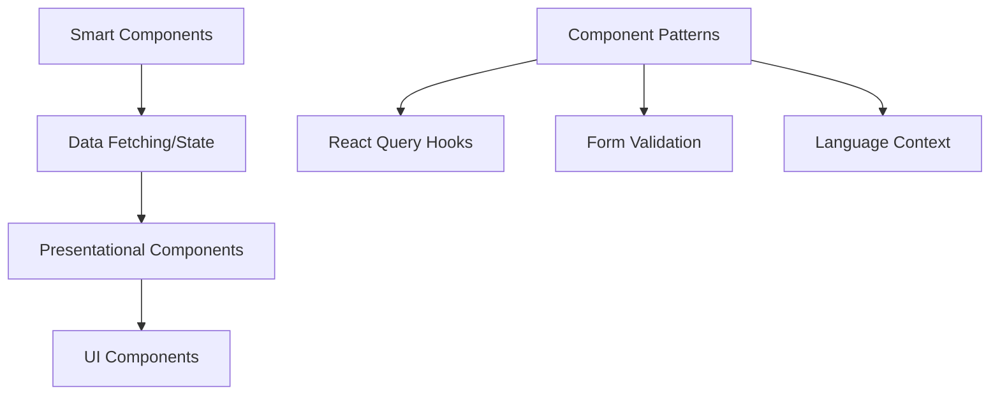

# Frontend Architecture

## Overview

The frontend application provides a web interface for the CV adaptation system. It handles user authentication, CV management, and generation workflows.

## Current Architecture

The frontend is built with:
- React 19+ with TypeScript for type safety and modern features
- React Query for server state management
- Tailwind CSS with DaisyUI for styling
- Zod for runtime type validation
- Vitest with workspace configuration for testing
- MSW for API mocking and contract testing

### State Management

1. **Server State**
   - React Query for data fetching and caching
   - Centralized hooks for reusable queries
   - Automated cache invalidation
   - Type-safe mutations

2. **Auth State**
   - Centralized auth context with React Query
   - Token-based authentication
   - Automatic token refresh
   - Protected route management

3. **Language System**
   - Enum-based language validation
   - Centralized language configuration
   - Type-safe language selection
   - Shared language utilities

## API Integration

### OpenAPI Schema

The OpenAPI schema for the backend API is maintained in `/web-interface/backend/docs/api/openapi.json`. This schema serves as:
- The source of truth for API contracts
- Documentation for API endpoints
- Base for generating TypeScript types
- Reference for contract testing

For new frontend implementations:
1. Use the schema from backend/docs/api during build
2. Generate TypeScript types from the schema
3. Implement contract testing against the schema

## Project Organization

### Feature-Based Structure
```
src/
├── features/           # Feature modules
│   ├── auth/          # Authentication
│   │   ├── components/
│   │   ├── hooks/
│   │   └── api/
│   ├── job-catalog/   # Job management
│   │   ├── components/
│   │   ├── hooks/
│   │   └── api/
│   └── cv-editor/     # CV editing
│       ├── components/
│       ├── hooks/
│       └── api/
├── lib/               # Shared utilities
│   ├── api/          # API configuration
│   ├── test/         # Test utilities
│   └── language/     # Language system
└── routes/           # Application routing
```

### Component Architecture


### Performance Optimizations
1. **Data Management**
   - React Query caching strategies
   - Optimistic updates
   - Background refetching
   - Parallel query optimization

2. **Bundle Optimization**
   - Code splitting by feature
   - Dynamic imports for routes
   - Tree shaking
   - Module/dependency optimization

3. **Development Experience**
   - Fast refresh enabled
   - Type checking optimization
   - Development proxy configuration
   - Enhanced debugging setup

## Security Considerations

The frontend implements comprehensive security measures:

1. **Authentication**
   - Token-based authentication with refresh mechanism
   - Secure token storage in memory
   - Automatic token refresh handling
   - Protected route infrastructure

2. **Data Validation**
   - Runtime validation with Zod schemas
   - Type-safe API contracts
   - Input sanitization
   - Error boundary implementation

3. **API Security**
   - HTTPS enforcement
   - API version management
   - Request/response validation
   - Error handling standardization

4. **Production Hardening**
   - Security headers configuration
   - CSP implementation
   - Asset integrity verification
   - Environment variable handling

## Testing Strategy

The frontend uses a comprehensive testing approach:
- Unit tests with Vitest and React Testing Library
- Integration tests for API interactions
- Contract tests for API type safety
- Component testing with user event simulation
