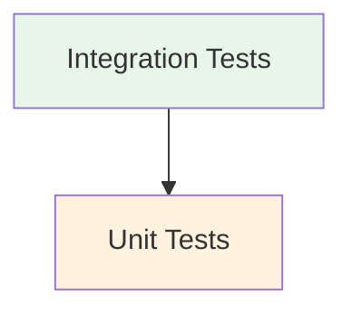

# Frontend Testing

This guide explains the frontend testing infrastructure and best practices.

## Testing Infrastructure

### 1. Testing Pyramid



### 2. API Contract & Type Safety

We ensure API contract compliance through:

1. **Type Generation**
   - Generated TypeScript types from OpenAPI schema
   - Automatic generation in pretest hook
   - Integration with CI/CD pipeline
   ```typescript
   // Example: Type generation script
   import { generateTypes } from '@/scripts/generate-api-types';
   generateTypes(); // Generates types from OpenAPI schema
   ```

2. **Type Safety**
   - Strongly typed API clients
   - MSW handlers using generated types
   - Response validation in integration tests
   ```typescript
   // Example: Typed MSW handler
   import type { paths } from '@/lib/api/types';
   type LoginResponse = paths['/auth/login']['post']['responses']['200'];

   server.use(
     http.post('/auth/login', () => {
       return HttpResponse.json<LoginResponse>({
         // Type-checked response
       });
     }),
   );
   ```

3. **Integration Testing**
   - Schema-based response validation
   - Type-safe request/response handling
   - API contract verification through typed tests
   ```typescript
   // Example: Type-safe API test
   test('authenticates user', async () => {
     const response = await loginUser(credentials);
     expectTypeOf(response).toMatchTypeOf<LoginResponse>();
   });
   ```

### 3. Test Types

1. **Integration Tests**
   - Complete user flows
   - Feature interactions
   - State management
   - API contract compliance
   - Real-world scenarios
   - Loading states
   - Error handling
   ```bash
   just test-frontend-integration
   ```

3. **Unit Tests**
   - Component isolation
   - Prop validation
   - Event handling
   - State changes
   - Side effects
   ```bash
   just test-frontend
   ```

## Project Structure

```
web-interface/frontend/
├── src/
│   ├── features/
│   │   └── feature-name/
│   │       └── __tests__/
│   │           ├── unit/
│   │           │   └── component.test.tsx
│   │           └── integration/
│   │               └── feature.test.tsx
│   └── lib/
│       └── test/
│           ├── setup/
│           │   ├── unit.ts
│           │   └── integration.ts
│           ├── handlers/
│           │   ├── generator.ts
│           │   └── auth.ts
│           ├── utils/
│           │   ├── render.tsx
│           │   ├── url-helper.ts
│           │   └── setup-msw.ts
│           └── config/
│               └── api.ts
├── vitest.workspace.ts
├── vitest.config.ts
└── vitest.integration.config.ts
```

## Testing Infrastructure

### 1. URL Management

```typescript
// lib/api/config.ts
export const API_VERSION = 'v1';
export const API_PREFIX = 'api';
export const BASE_PATH = `/${API_VERSION}/${API_PREFIX}`;

// lib/test/url-helper.ts
export function getTestApiUrl(path: string): string {
  // Sanitize and validate path
  return `${BASE_PATH}/${cleanPath}`;
}

// Handler usage
createGetHandler('jobs', 'JobResponse', mockData);
// Generates: GET /v1/api/jobs
```

### 2. MSW Configuration

1. **Handler Generation**
   ```typescript
   // lib/test/handlers/generator.ts
   import { generateHandlers } from './generator';
   import { paths } from '../../../generated/api';

   export const handlers = generateHandlers<paths>({
     // Handler configuration with type checking
     'POST /api/v1/auth/login': {
       response: {
         status: 200,
         data: mockAuthResponse
       }
     }
   });
   ```

2. **Test Setup**
   ```typescript
   // lib/test/utils/setup-msw.ts
   import { setupServer } from 'msw/node';
   import { handlers } from '../handlers';

   export const server = setupServer(...handlers);

   beforeAll(() => server.listen({ onUnhandledRequest: 'error' }));
   afterAll(() => server.close());
   ```

### 3. Test Utilities

```typescript
// lib/test/utils/render.tsx
import { QueryClient, QueryClientProvider } from '@tanstack/react-query';
import { AuthProvider } from '@/features/auth/context';

export const createWrapper = () => {
  const queryClient = new QueryClient({
    defaultOptions: {
      queries: {
        retry: false,
      },
    },
  });

  return ({ children }: { children: React.ReactNode }) => (
    <QueryClientProvider client={queryClient}>
      <AuthProvider>{children}</AuthProvider>
    </QueryClientProvider>
  );
};
```

## Testing Examples

### 1. Component Test
```typescript
// features/auth/components/__tests__/unit/LoginForm.test.tsx
import { render, screen } from '@testing-library/react';
import { createWrapper } from '@/lib/test/utils/render';
import { LoginForm } from '../../LoginForm';

describe('LoginForm', () => {
  const wrapper = createWrapper();

  it('validates form inputs', async () => {
    render(<LoginForm />, { wrapper });

    await userEvent.click(screen.getByRole('button', { name: /sign in/i }));

    expect(screen.getByText(/email is required/i)).toBeInTheDocument();
  });
});
```

### 2. Integration Test
```typescript
// features/job-catalog/__tests__/integration/job-operations.test.tsx
import { render, screen } from '@testing-library/react';
import { createWrapper } from '@/lib/test/utils/render';
import { JobList } from '../../components/JobList';
import { mockJobs } from '@/lib/test/mocks/jobs';
import { getTestApiUrl } from '@/lib/test/url-helper';

describe('Job Operations', () => {
  const wrapper = createWrapper();

  beforeEach(() => {
    server.use(
      rest.get(getTestApiUrl('jobs'), (req, res, ctx) => {
        return res(ctx.json(mockJobs));
      })
    );
  });

  it('displays and filters jobs', async () => {
    render(<JobList />, { wrapper });

    await screen.findByText(mockJobs[0].title);

    await userEvent.click(screen.getByRole('button', { name: /filter/i }));
    await userEvent.click(screen.getByText(/english/i));

    expect(screen.queryByText(/deutsche/i)).not.toBeInTheDocument();
  });
});
```

## Test Configuration

### Vitest Workspace

```typescript
// vitest.workspace.ts
export default defineWorkspace([
  {
    // Unit tests configuration
    extends: './vitest.config.ts',
    test: {
      name: 'unit',
      globals: true,
      environment: 'jsdom',
      setupFiles: ['./src/lib/test/setup.ts'],
      include: ['src/**/__tests__/*.{test,spec}.{js,jsx,ts,tsx}'],
      exclude: ['src/**/__tests__/integration/**'],
    },
  },
  {
    // Integration tests configuration
    extends: './vitest.config.ts',
    test: {
      name: 'integration',
      globals: true,
      environment: 'jsdom',
      setupFiles: ['./src/lib/test/integration/setup.ts'],
      include: ['src/**/__tests__/integration/*.integration.test.{ts,tsx}'],
      testTimeout: 15000,
      hookTimeout: 15000,
      maxConcurrency: 1,
      isolate: true,
      sequence: {
        shuffle: false
      }
    },
  },
]);
```

## Running Tests

### Test Commands

```bash
# Run specific test suites
just test-frontend          # Unit tests
just test-frontend-integration  # Integration tests

# Coverage reporting
just test-frontend-cov

# Run all tests and coverage
just test-frontend-all     # All tests with coverage

# Watch mode
cd web-interface/frontend
npm run test:watch         # Unit tests
npm run test:integration   # Integration tests
```

### Test Scripts

```json
{
  "test": "vitest",
  "test:unit": "vitest --project unit",
  "test:integration": "vitest --project integration",
  "test:coverage": "vitest run --coverage",
  "test:ci": "vitest run --coverage",
  "pretest": "npm run generate-api-types"
}
```

## Best Practices

### 1. Test Organization
- Co-locate tests with implementation
- Use descriptive test names
- Group related tests
- Maintain test independence

### 2. Testing Standards
- Use centralized MSW handlers
- Use getTestApiUrl for all API paths
- Utilize handler generators
- Share mock data between tests
- Test component accessibility
- Verify loading states
- Test error scenarios
- Validate API path consistency

### 3. Coverage Requirements
- Minimum 80% code coverage
- Critical paths: 100%
- Error scenarios
- Edge cases

### 4. Performance Testing
- Loading performance
- React Query caching
- Component re-renders
- Network request optimization
