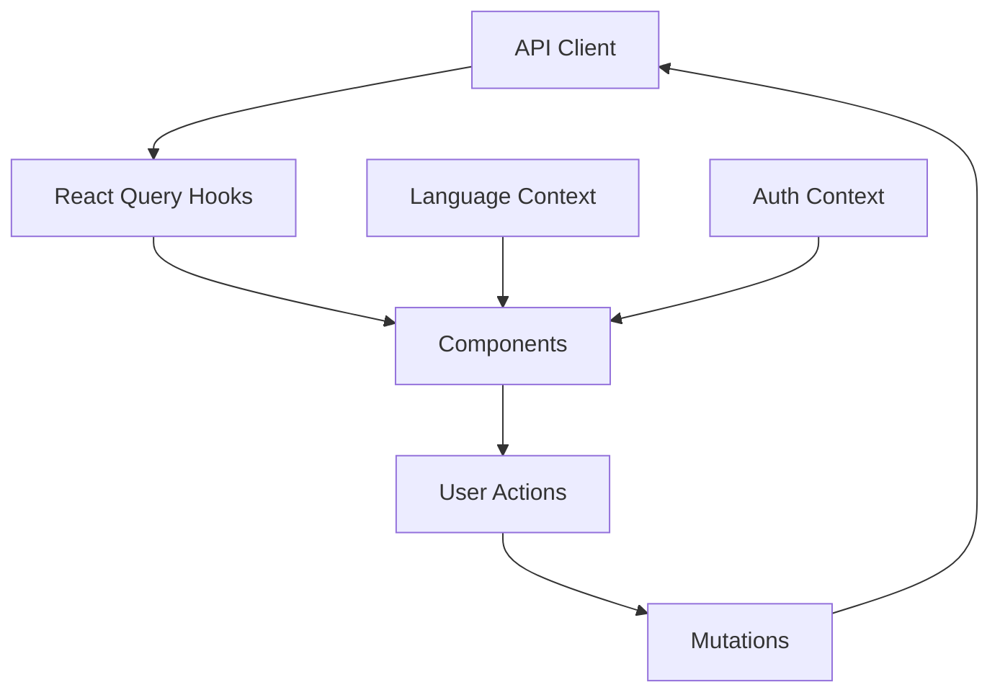

# Implementing Job Description Catalog

## Overview

The job description catalog is a core feature that allows users to manage multilingual job descriptions. This guide covers implementation details, language support, and authentication integration.

## Architecture

### Feature Organization
```
src/features/job-catalog/
├── components/              # UI Components
│   ├── JobList.tsx         # Job grid with filtering
│   ├── JobForm/            # Forms with validation
│   │   ├── index.tsx
│   │   ├── validation.ts
│   │   └── hooks.ts
│   ├── JobDetail.tsx       # Detailed view
│   └── language/           # Language components
│       ├── LanguageFilter.tsx
│       └── LanguageBadge.tsx
├── api/                    # API Integration
│   ├── jobsApi.ts         # API functions
│   └── __tests__/         # API tests
│       ├── jobsApi.test.ts
│       ├── jobsApi.contract.test.ts
│       └── jobsApi.integration.test.ts
├── hooks/                  # Data Management
│   ├── useJobs.ts         # Query hooks
│   ├── useJobMutations.ts # Mutations
│   └── useJobLanguage.ts  # Language state
└── __tests__/             # Feature Tests
    ├── unit/
    └── integration/
```

### Data Flow


## Implementation Details

### 1. Language Support

1. **Language System Integration**
   ```typescript
   // hooks/useJobLanguage.ts
   import { useLanguageContext } from '@/lib/language';
   import { LanguageCode } from '@/generated/api';

   export const useJobLanguage = () => {
     const { language } = useLanguageContext();
     const [filter, setFilter] = useState<LanguageCode | null>(null);

     // Filter jobs by language
     const filterJobs = (jobs: Job[]) => {
       if (!filter) return jobs;
       return jobs.filter(job => job.language === filter);
     };

     return { filter, setFilter, filterJobs };
   };
   ```

2. **Language Filter Component**
   ```typescript
   // components/language/LanguageFilter.tsx
   import { Menu } from '@headlessui/react';
   import { LanguageCode } from '@/generated/api';

   export const LanguageFilter = () => {
     const { filter, setFilter } = useJobLanguage();
     const { languages } = useLanguageContext();

     return (
       <Menu as="div" className="relative">
         <Menu.Button>Filter by Language</Menu.Button>
         <Menu.Items>
           {languages.map(lang => (
             <Menu.Item key={lang}>
               {({ active }) => (
                 <Button
                   className={active ? 'bg-primary-100' : ''}
                   onClick={() => setFilter(lang)}
                 >
                   {lang}
                 </Button>
               )}
             </Menu.Item>
           ))}
         </Menu.Items>
       </Menu>
     );
   };
   ```

### 2. Auth Integration

1. **Protected Routes**
   ```typescript
   // routes/jobs.tsx
   import { ProtectedRoute } from '@/features/auth';

   export const JobRoutes = () => (
     <ProtectedRoute>
       <Routes>
         <Route path="/" element={<JobList />} />
         <Route path="/new" element={<JobForm />} />
         <Route path="/:id" element={<JobDetail />} />
         <Route path="/:id/edit" element={<JobForm />} />
       </Routes>
     </ProtectedRoute>
   );
   ```

2. **Authenticated API Calls**
   ```typescript
   // api/jobsApi.ts
   import { useAuthHeader } from '@/features/auth';

   export const jobsApi = {
     getJobs: async () => {
       const headers = useAuthHeader();
       return axios.get('/api/v1/jobs', { headers });
     },
     // Other API functions
   };
   ```

### 3. Components

1. **Job List with Language Filtering**
   ```typescript
   // components/JobList.tsx
   export const JobList = () => {
     const { data: jobs, isLoading } = useJobs();
     const { filterJobs } = useJobLanguage();
     const filteredJobs = filterJobs(jobs ?? []);

     return (
       <div>
         <header className="flex justify-between">
           <h1>Jobs</h1>
           <LanguageFilter />
         </header>

         {isLoading ? (
           <JobsLoadingGrid />
         ) : (
           <div className="grid grid-cols-1 md:grid-cols-2 lg:grid-cols-3 gap-4">
             {filteredJobs.map(job => (
               <JobCard
                 key={job.id}
                 job={job}
                 language={job.language}
               />
             ))}
           </div>
         )}
       </div>
     );
   };
   ```

2. **Job Form with Language Selection**
   ```typescript
   // components/JobForm/index.tsx
   export const JobForm = () => {
     const { languages } = useLanguageContext();
     const { createJob } = useJobMutations();

     return (
       <form onSubmit={handleSubmit(onSubmit)}>
         {/* ... other fields */}
         <Select
           name="language"
           options={languages}
           label="Job Language"
           rules={{ required: 'Language is required' }}
         />
       </form>
     );
   };
   ```

## Testing Strategy

### 1. Unit Tests

1. **Component Tests**
   ```typescript
   // components/__tests__/unit/JobList.test.tsx
   describe('JobList', () => {
     it('filters jobs by language', async () => {
       const jobs = [
         createJob({ language: 'en' }),
         createJob({ language: 'de' })
       ];

       server.use(
         rest.get('/api/v1/jobs', (_, res, ctx) => {
           return res(ctx.json(jobs));
         })
       );

       render(<JobList />, { wrapper });

       // Wait for jobs to load
       await screen.findByText(jobs[0].title);

       // Filter by language
       await userEvent.click(screen.getByText(/filter/i));
       await userEvent.click(screen.getByText(/english/i));

       // Verify filtering
       expect(screen.queryByText(jobs[1].title)).not.toBeInTheDocument();
     });
   });
   ```

2. **Hook Tests**
   ```typescript
   // hooks/__tests__/useJobLanguage.test.ts
   describe('useJobLanguage', () => {
     it('filters jobs correctly', () => {
       const { result } = renderHook(() => useJobLanguage());

       act(() => {
         result.current.setFilter('en');
       });

       const jobs = [
         { id: 1, language: 'en' },
         { id: 2, language: 'de' }
       ];

       const filtered = result.current.filterJobs(jobs);
       expect(filtered).toHaveLength(1);
       expect(filtered[0].language).toBe('en');
     });
   });
   ```

### 2. Integration Tests

1. **Job Operations**
   ```typescript
   // __tests__/integration/job-operations.test.tsx
   describe('Job Operations', () => {
     it('creates and filters jobs', async () => {
       // Login user
       await loginUser();

       // Create job
       await navigateToNewJob();
       await fillJobForm({
         title: 'Test Job',
         language: 'en'
       });
       await submitForm();

       // Filter jobs
       await filterByLanguage('en');

       // Verify job is visible
       expect(screen.getByText('Test Job')).toBeInTheDocument();
     });
   });
   ```

2. **Auth Integration**
   ```typescript
   // __tests__/integration/auth-protection.test.tsx
   describe('Auth Protection', () => {
     it('redirects to login when unauthorized', async () => {
       // Clear auth
       queryClient.clear();
       removeSavedTokens();

       // Try to access jobs
       navigate('/jobs');

       // Verify redirect
       expect(await screen.findByText(/sign in/i)).toBeInTheDocument();
       expect(window.location.pathname).toBe('/login');
     });
   });
   ```

## API Integration

### 1. Type Generation
```typescript
// scripts/generate-api-types.ts
import { generateApi } from '@modelcontextprotocol/openapi-typescript';

generateApi({
  input: '../backend/docs/api/openapi.json',
  output: './src/generated/api.ts',
  exportClient: true,
  prettier: true
});
```

### 2. React Query Hooks
```typescript
// hooks/useJobs.ts
import { useQuery, useMutation } from '@tanstack/react-query';
import { jobsApi } from '../api/jobsApi';
import type { Job } from '@/generated/api';

export const useJobs = () => {
  return useQuery<Job[]>({
    queryKey: ['jobs'],
    queryFn: jobsApi.getJobs
  });
};

export const useJobMutations = () => {
  const queryClient = useQueryClient();

  const createJob = useMutation({
    mutationFn: jobsApi.createJob,
    onSuccess: () => {
      queryClient.invalidateQueries({ queryKey: ['jobs'] });
    }
  });

  return { createJob };
};
```

## Future Enhancements

### Planned Features
1. **Advanced Filtering**
   - Title search
   - Date ranges
   - Multiple language selection
   - Custom filter combinations

2. **Job Templates**
   - Template management
   - Language-specific templates
   - Quick job creation

3. **Bulk Operations**
   - Multi-select jobs
   - Batch language updates
   - Bulk delete with confirmation

4. **Export/Import**
   - Export jobs as JSON/CSV
   - Import from file
   - Batch language translation
