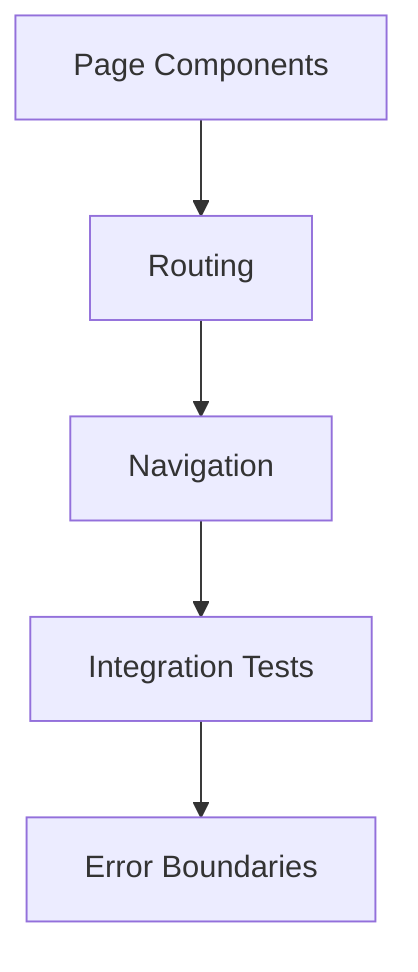

# Implementation Plan

## Overview

CV Adapt's frontend is a modern React application built with TypeScript, focusing on type safety, component reusability, and maintainable architecture. The implementation follows a feature-based organization pattern with comprehensive testing.

## Current Status

All core features from Phase 1-4 have been completed and consolidated:

- Project infrastructure and setup ✓
- Authentication system with React Query ✓
- Job catalog with full CRUD operations ✓
  - Job listing with language filtering ✓
  - Job management UI components ✓
  - Form validation and submission ✓
  - Comprehensive test coverage ✓
- Detailed CV Management components ✓
  - DetailedCVList with language filtering ✓
  - DetailedCVForm with markdown support ✓
  - DetailedCVPreview with markdown rendering ✓
  - API integration and React Query hooks ✓
  - Unit tests for components ✓
  - Unified form handling for creation/editing ✓
  - Improved type safety with required language codes ✓

For details on completed phases, see [docs/archive/COMPLETED_PHASES.md](docs/archive/COMPLETED_PHASES.md).
For testing strategy details, see [docs/TESTING_STRATEGY.md](docs/TESTING_STRATEGY.md).

## Current Focus

### Detailed CV Management Integration



#### Integration Tasks

1. **Page Components**

   - Create page components for detailed CV management ✓
   - Implement layout and container components ✓
   - Add navigation and breadcrumbs
   - Unified form handling for consistent UX ✓

2. **Routing**

   - Add routes for detailed CV management ✓
   - Implement route protection ✓
   - Add route parameters for CV editing ✓
   - Single route for create/edit operations ✓

3. **Error Handling**
   - Implement error boundaries
   - Add fallback UI components
   - Improve error messaging
   - Type-safe error handling ✓

## Pattern Decisions

### Form Page Pattern

- Use unified form pages for create/edit operations
- Handle mode differences through URL parameters and data presence
- Consistent error handling and loading states
- Required language code for type safety
- Centralized navigation handling

### Component Refinements

- Co-locate related components
- Remove redundant wrappers
- Clear separation of page-level and form-level concerns
- Type-safe props with required fields

## Upcoming Work

### Phase 4: CV Management

1. Backend Integration

   - API endpoint configuration
   - CV data structures
   - Template management
   - Export handling

2. UI Components

   - CV editor interface
   - Template selection
   - Preview functionality
   - Export dialog

3. Language Support
   - Multi-language CV support ✓
   - Language switching ✓
   - Translation management

### Phase 5: Advanced Features

1. Template System

   - Custom template support
   - Style customization
   - Layout options

2. Export Capabilities

   - PDF generation
   - Multiple formats
   - Style preservation

3. Collaboration Features
   - Sharing options
   - Review system
   - Version control

## Architecture Decisions

### 1. Component Architecture

```
// Feature-based organization
features/
  feature-name/
    components/
      ComponentName/        // Each component in its directory
        index.tsx          // Component definition
        __tests__/        // Component tests
        types.ts         // Component-specific types
    hooks/               // Custom hooks
    utils/              // Helper functions
    types.ts            // Feature types
    constants.ts        // Feature constants
```

### 2. State Management

- React Query for server state
- Local state with hooks
- Context for global state
- Strict TypeScript usage

### 3. UI Component Strategy

- Headless UI for accessibility
- DaisyUI for styling
- Custom components for business logic
- Composition over inheritance
- Unified form handling patterns

## Development Guidelines

### Code Organization

- Feature-based structure
- Clear separation of concerns
- Consistent file naming
- Code co-location
- Single responsibility components

### Type Safety

- Strict TypeScript configuration
- OpenAPI type generation
- Proper type imports
- No any types
- Required props for clarity

### Testing Standards

- Unit tests for components
- Integration tests for features
- Comprehensive mock setup
- Type-safe test utilities

### Accessibility

- ARIA attributes
- Keyboard navigation
- Screen reader support
- Color contrast
- Focus management

## Documentation Requirements

### Component Documentation

- Usage examples
- Props documentation
- State management
- Integration points
- Pattern decisions

### Testing Documentation

- Test strategy
- Mock patterns
- Integration test setup
- Error handling verification
