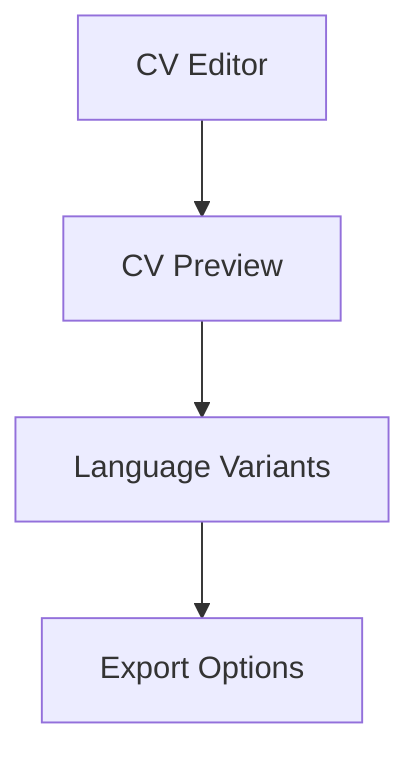

# Implementation Plan

## Overview

CV Adapt's frontend is a modern React application built with TypeScript, focusing on type safety, component reusability, and maintainable architecture. The implementation follows a feature-based organization pattern with comprehensive testing.

## Current Status

All core features from Phase 1-3 have been completed:
- Project infrastructure and setup ✓
- Authentication system with React Query ✓
- Job catalog with full CRUD operations ✓

For details on completed phases, see [docs/archive/COMPLETED_PHASES.md](docs/archive/COMPLETED_PHASES.md).
For testing strategy details, see [docs/TESTING_STRATEGY.md](docs/TESTING_STRATEGY.md).

## Current Focus

### CV Management Feature


#### Components to Implement
```typescript
features/cv-management/
  components/
    CVList.tsx       // CV overview and management
    CVEditor.tsx     // CV content editing
    CVPreview.tsx    // Real-time preview
    ExportDialog.tsx // Export options
  hooks/
    useCVs.ts           // CV data management
    useCVGeneration.ts  // CV generation utilities
  types.ts
  utils.ts
```

#### Key Features
1. CV Editor
   - Rich text editing
   - Section management
   - Template selection
   - Real-time preview

2. Language Support
   - Multi-language CV versions
   - Language-specific formatting
   - Translation management

3. Export Options
   - Multiple format support
   - Template customization
   - Style configuration

## Upcoming Work

### Phase 4: CV Management

1. Backend Integration
   - API endpoint configuration
   - CV data structures
   - Template management
   - Export handling

2. UI Components
   - CV editor interface
   - Template selection
   - Preview functionality
   - Export dialog

3. Language Support
   - Multi-language CV support
   - Language switching
   - Translation management

### Phase 5: Advanced Features

1. Template System
   - Custom template support
   - Style customization
   - Layout options

2. Export Capabilities
   - PDF generation
   - Multiple formats
   - Style preservation

3. Collaboration Features
   - Sharing options
   - Review system
   - Version control

## Architecture Decisions

### 1. Component Architecture
```typescript
// Feature-based organization
features/
  feature-name/
    components/  // Feature-specific components
    hooks/       // Custom hooks
    utils/       // Helper functions
    types.ts     // Type definitions
    constants.ts // Feature constants
```

### 2. State Management
- React Query for server state
- Local state with hooks
- Context for global state
- Strict TypeScript usage

### 3. UI Component Strategy
- Headless UI for accessibility
- DaisyUI for styling
- Custom components for business logic
- Composition over inheritance

## Development Guidelines

### Code Organization
- Feature-based structure
- Clear separation of concerns
- Consistent file naming
- Code co-location

### Type Safety
- Strict TypeScript configuration
- OpenAPI type generation
- Proper type imports
- No any types

### Performance Standards
- Bundle size monitoring
- Code splitting
- React Query caching
- Lazy loading

### Accessibility
- ARIA attributes
- Keyboard navigation
- Screen reader support
- Color contrast
- Focus management

## Documentation Requirements

### API Integration
- OpenAPI schema usage
- Type generation workflow
- Response handling
- Error management

### Component Documentation
- Usage examples
- Props documentation
- State management
- Integration points

### Setup Instructions
- Development setup
- Testing environment
- Build process
- Deployment workflow
