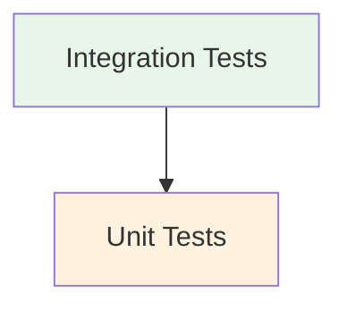

# Testing Strategy

## Overview

Our testing approach follows a comprehensive strategy that ensures code quality, reliability, and maintainability through multiple testing layers.

## Testing Pyramid



## Type Safety & API Contract

We ensure API contract compliance through:

- Generated TypeScript types from OpenAPI schema
- Automatic type generation in CI/CD pipeline
- Type checking during development and builds
- Integration tests using typed API responses
- MSW handlers conforming to API types

## Test Types

### Integration Tests

#### Navigation Testing Infrastructure

We use a dedicated navigation testing infrastructure to handle routing and navigation testing consistently:

```typescript
// Example: Navigation verification
await NavigationTestUtils.verifyNavigation({
  pathname: ROUTES.DETAILED_CVS.CREATE('en'),
  waitForElement: {
    role: 'form',
  },
  waitForLoading: true,
});

// Example: Route setup
const routes = [
  createRouteConfig('/', <Layout />, [
    createRouteConfig('feature', <ProtectedRoute />, [
      createRouteConfig('', <ListPage />),
      createRouteConfig(':id', <DetailPage />),
    ]),
  ]),
];
```

#### Navigation Test Organization

We organize navigation tests into three categories:

1. Route Tests

   - Focus on route protection and access control
   - Test authentication requirements
   - Verify redirects and fallbacks

2. List Navigation Tests

   - Test navigation from list views
   - Verify create/detail navigation flows
   - Test list-specific operations

3. Form Operation Tests
   - Test form submission navigation
   - Verify success/error redirects
   - Test edit/create flow differences

#### Infrastructure

- Schema-based handler generation
- Integration-specific test server
- OpenAPI contract validation
- Standard response patterns
- React Query integration
- Proper async operation handling
- Mutation state management

#### Focus Areas

- Complete user flows
- Feature interactions
- State management
- API contract compliance
- Real-world scenarios
- Loading states
- Error handling

#### Directory Structure

```
features/
  auth/
    __tests__/
      integration/
        protected-routes.test.tsx    # Route protection
        auth-flow.test.tsx          # Authentication flows
  detailed-cv/
    __tests__/
      integration/
        protected-route.test.tsx    # Route protection
        detailed-cv-list.test.tsx   # List navigation
        detailed-cv-form.test.tsx   # Form operations
  routes/
    __tests__/
      integration/
        common-routes.test.tsx      # Shared route behavior
```

### Unit Tests

#### Component Testing

- Loading state verification
- Error state handling
- Form validation
- User interaction flows
- Accessibility checks
- Component isolation
- Role-based queries

#### Hook Testing

- Mock providers (Auth, Query)
- Mock localStorage
- Mock API responses
- React Query integration
- Mutation state management
- Cache behavior

#### React Query Testing Patterns

```typescript
// 1. Create a mock module function
const mockUseMutation = vi.fn();

// 2. Mock the module
vi.mock('./hooks/useMutation', () => ({
  useMutation: () => mockUseMutation(),
}));

// 3. Create type-safe mock data
const createMockMutation = (mutateAsync = vi.fn().mockResolvedValue({})) => ({
  mutateAsync,
  mutate: vi.fn(),
  variables: undefined,
  data: undefined,
  error: null,
  isError: false as const,
  isPending: false as const,
  isSuccess: false as const,
  isIdle: true as const,
  status: 'idle' as const,
  reset: vi.fn(),
  context: undefined,
  isPaused: false,
  submittedAt: 0,
});

// 4. Use in tests
beforeEach(() => {
  mockUseMutation.mockReturnValue(createMockMutation());
});

// 5. Override for specific tests
const mockSpecificMutation = vi.fn().mockResolvedValue({ id: 1 });
mockUseMutation.mockReturnValue(createMockMutation(mockSpecificMutation));
```

Key benefits:

- Type-safe mutation mocks
- Consistent state flags
- Reusable mock creation
- Easy per-test overrides
- Complete type coverage
- Centralized mock patterns

#### Best Practices

- Provider isolation
- Mock consistency
- Type safety
- Error boundary testing
- Async operation handling

## Testing Infrastructure

### MSW (Mock Service Worker)

- Centralized handler setup
- Request/response mocking
- Error scenario simulation
- Network behavior simulation
- Contract validation

### Navigation Testing Utilities

```typescript
// Navigation verification
await NavigationTestUtils.verifyNavigation({
  pathname: expectedPath,
  waitForElement: {
    role: 'form',
    name: /title/i,
  },
  waitForLoading: true,
});

// Action-triggered navigation
await NavigationTestUtils.verifyActionNavigation(
  async () => {
    await user.click(submitButton);
  },
  {
    pathname: '/success',
    waitForElement: {
      role: 'alert',
      name: /success/i,
    },
  },
);

// Navigation result verification
await NavigationTestUtils.verifyNavigationResult({
  waitForElement: {
    role: 'button',
    name: /new item/i,
  },
  shouldMount: true,
});
```

### Feature Test Setup

```typescript
const { user } = await setupFeatureTest({
  routes,
  initialPath: ROUTES.FEATURE.LIST,
  authenticatedUser: true,
  handlers: [createGetHandler('/api/items', 'ItemResponse', mockData)],
});
```

### Development Guidelines

#### Testing Requirements

1. Integration Tests (Feature Level)

   - Route protection tests
   - List navigation tests
   - Form operation tests
   - Error handling scenarios
   - Loading state verification

2. Unit Tests (Component Level)

   - Component isolation
   - Prop validation
   - Event handling
   - State changes
   - Side effects

3. Contract Tests (API Level)
   - Type safety
   - Schema validation
   - Error responses
   - Success patterns

### Best Practices

1. Test Organization

   - Co-locate tests with implementation
   - Group by test category (route/list/form)
   - Maintain test independence
   - Use proper file naming

2. Testing Standards

   - Use navigation testing utilities
   - Follow route testing patterns
   - Use handler generators
   - Share route configs
   - Test loading states
   - Verify error scenarios
   - Follow naming conventions

3. Coverage Requirements

   - Minimum 80% code coverage
   - Critical paths: 100%
   - Error scenarios
   - Edge cases

4. Performance Testing
   - Loading performance
   - React Query caching
   - Component re-renders
   - Network request optimization

## Test Configuration

[Configuration sections remain unchanged...]
