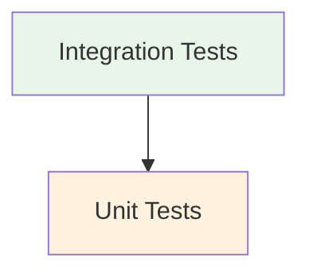

# Testing Strategy

## Overview

Our testing approach follows a comprehensive strategy that ensures code quality, reliability, and maintainability through multiple testing layers.

## Testing Pyramid



## Type Safety & API Contract

We ensure API contract compliance through:

- Generated TypeScript types from OpenAPI schema
- Automatic type generation in CI/CD pipeline
- Type checking during development and builds
- Integration tests using typed API responses
- MSW handlers conforming to API types

## Test Types

### Integration Tests

#### Infrastructure

- Schema-based handler generation
- Integration-specific test server
- OpenAPI contract validation
- Standard response patterns
- React Query integration
- Proper async operation handling
- Mutation state management

#### Focus Areas

- Complete user flows
- Feature interactions
- State management
- API contract compliance
- Real-world scenarios
- Loading states
- Error handling

#### Directory Structure

```
features/
  auth/
    __tests__/
      integration/
        auth-flow.integration.test.tsx
        token-management.integration.test.tsx
  job-catalog/
    __tests__/
      integration/
        job-operations.integration.test.tsx
        language-filter.integration.test.tsx
  routes/
    __tests__/
      integration/
        protected-routes.integration.test.tsx
```

### Unit Tests

#### Component Testing

- Loading state verification
- Error state handling
- Form validation
- User interaction flows
- Accessibility checks
- Component isolation
- Role-based queries

#### Hook Testing

- Mock providers (Auth, Query)
- Mock localStorage
- Mock API responses
- React Query integration
- Mutation state management
- Cache behavior

#### Best Practices

- Provider isolation
- Mock consistency
- Type safety
- Error boundary testing
- Async operation handling

## Testing Infrastructure

### MSW (Mock Service Worker)

- Centralized handler setup
- Request/response mocking
- Error scenario simulation
- Network behavior simulation
- Contract validation

### URL Management

The testing infrastructure includes a centralized system for managing API URLs:

```typescript
// Configuration (lib/api/config.ts)
export const API_VERSION = 'v1';
export const API_PREFIX = 'api';
export const BASE_PATH = `/${API_VERSION}/${API_PREFIX}`;

// URL Helper (lib/test/url-helper.ts)
export function getTestApiUrl(path: string): string {
  // Sanitize and validate path
  return `${BASE_PATH}/${cleanPath}`;
}

// Handler Generator Usage
createGetHandler('jobs', 'JobResponse', mockData);
// Generates: GET /v1/api/jobs

// Direct MSW Usage
http.get(getTestApiUrl('jobs'), responseHandler);
// Generates: GET /v1/api/jobs
```

Key Features:

- Centralized API configuration
- Path validation and sanitization
- Type-safe URL generation
- Environment-specific configurations
- Integration with MSW handlers

### Test Utilities

```typescript
// Custom render with providers
render(ui: React.ReactElement, {
  preloadedState,
  queryClient,
  ...options
}: TestOptions = {})

// Handler Generation
createGetHandler<T extends Schema>(path: string, schemaKey: T, response: T)
createPostHandler<T, R>(path: string, reqSchema: T, resSchema: R, response: R)

// URL Management
getTestApiUrl(path: string): string
getBaseUrl(environment: ApiEnvironment): string

// Auth test utilities
mockAuthenticatedUser()
mockUnauthenticatedState()
```

### Development Guidelines

#### Testing Requirements

1. Integration Tests (Feature Level)

   - User flow coverage
   - API interaction testing
   - Error handling scenarios
   - Loading state verification
   - State management validation

2. Unit Tests (Component Level)

   - Component isolation
   - Prop validation
   - Event handling
   - State changes
   - Side effects

3. Contract Tests (API Level)
   - Type safety
   - Schema validation
   - Error responses
   - Success patterns

### Best Practices

1. Test Organization

   - Co-locate tests with implementation
   - Use descriptive test names
   - Group related tests
   - Maintain test independence

2. Testing Standards

   - Use centralized MSW handlers
   - Use getTestApiUrl for all API paths
   - Utilize handler generators for consistent responses
   - Share mock data between tests
   - Test component accessibility
   - Verify loading states
   - Test error scenarios
   - Implement request debugging
   - Validate API path consistency

3. Coverage Requirements

   - Minimum 80% code coverage
   - Critical paths: 100%
   - Error scenarios
   - Edge cases

4. Performance Testing
   - Loading performance
   - React Query caching
   - Component re-renders
   - Network request optimization

## Test Configuration

### Vitest Workspace

We use Vitest workspaces to organize our tests into separate projects with specific configurations:

```typescript
// vitest.workspace.ts
export default defineWorkspace([
  {
    // Unit tests configuration
    extends: './vitest.config.ts',
    test: {
      name: 'unit',
      globals: true,
      environment: 'jsdom',
      setupFiles: ['./src/lib/test/setup.ts'],
      include: ['src/**/__tests__/*.{test,spec}.{js,jsx,ts,tsx}'],
      exclude: ['src/**/__tests__/integration/**'],
    },
  },
  {
    // Integration tests configuration
    extends: './vitest.config.ts',
    test: {
      name: 'integration',
      globals: true,
      environment: 'jsdom',
      setupFiles: ['./src/lib/test/integration/setup.ts'],
      include: ['src/**/__tests__/integration/*.integration.test.{ts,tsx}'],
      testTimeout: 15000,
      hookTimeout: 15000,
      maxConcurrency: 1,
      isolate: true,
      sequence: {
        shuffle: false,
      },
      deps: {
        optimizer: {
          web: {
            include: ['@testing-library/*'],
          },
        },
      },
    },
  },
]);
```

Key features of the workspace configuration:

- Separate configurations for unit and integration tests
- Extended timeout for integration tests to handle async operations
- Single test concurrency for integration tests to prevent race conditions
- Disabled test shuffling for more predictable test runs
- Proper environment and setup file configuration for each test type
- Shared coverage configuration through base vitest.config.ts

## Test Scripts

```json
{
  "test": "vitest",
  "test:unit": "vitest --project unit",
  "test:integration": "vitest --project integration",
  "test:coverage": "vitest run --coverage",
  "test:ci": "vitest run --coverage",
  "pretest": "npm run generate-api-types"
}
```

## Tools and Libraries

- Vitest - Test runner
- React Testing Library - Component testing
- MSW - API mocking
- @testing-library/user-event - User interaction simulation
- @testing-library/jest-dom - DOM assertions

## Continuous Integration

- Run all tests on PR
- Coverage reporting
- Contract validation
- Type checking
- Linting verification
