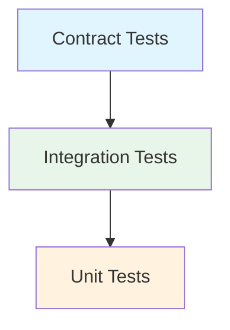

# Testing Strategy

## Overview

Our testing approach follows a comprehensive strategy that ensures code quality, reliability, and maintainability through multiple testing layers.

## Testing Pyramid



## Test Types

### Contract Tests

- OpenAPI schema validation
- Response type checking
- Error handling verification
- API path consistency
- Type safety enforcement

### Integration Tests

#### Infrastructure

- Schema-based handler generation
- Integration-specific test server
- OpenAPI contract validation
- Standard response patterns
- React Query integration
- Proper async operation handling
- Mutation state management

#### Focus Areas

- Complete user flows
- Feature interactions
- State management
- API contract compliance
- Real-world scenarios
- Loading states
- Error handling

#### Directory Structure

```
features/
  auth/
    __tests__/
      integration/
        auth-flow.integration.test.tsx
        token-management.integration.test.tsx
  job-catalog/
    __tests__/
      integration/
        job-operations.integration.test.tsx
        language-filter.integration.test.tsx
  routes/
    __tests__/
      integration/
        protected-routes.integration.test.tsx
```

### Unit Tests

#### Component Testing

- Loading state verification
- Error state handling
- Form validation
- User interaction flows
- Accessibility checks
- Component isolation
- Role-based queries

#### Hook Testing

- Mock providers (Auth, Query)
- Mock localStorage
- Mock API responses
- React Query integration
- Mutation state management
- Cache behavior

#### Best Practices

- Provider isolation
- Mock consistency
- Type safety
- Error boundary testing
- Async operation handling

## Testing Infrastructure

### MSW (Mock Service Worker)

- Centralized handler setup
- Request/response mocking
- Error scenario simulation
- Network behavior simulation
- Contract validation

### Test Utilities

```typescript
// Custom render with providers
render(ui: React.ReactElement, {
  preloadedState,
  queryClient,
  ...options
}: TestOptions = {})

// API test helpers
createMockHandler(path, method, response)
createErrorHandler(path, method, error)

// Auth test utilities
mockAuthenticatedUser()
mockUnauthenticatedState()
```

### Development Guidelines

#### Testing Requirements

1. Integration Tests (Feature Level)

   - User flow coverage
   - API interaction testing
   - Error handling scenarios
   - Loading state verification
   - State management validation

2. Unit Tests (Component Level)

   - Component isolation
   - Prop validation
   - Event handling
   - State changes
   - Side effects

3. Contract Tests (API Level)
   - Type safety
   - Schema validation
   - Error responses
   - Success patterns

### Best Practices

1. Test Organization

   - Co-locate tests with implementation
   - Use descriptive test names
   - Group related tests
   - Maintain test independence

2. Testing Standards

   - Use centralized MSW handlers
   - Maintain consistent API paths
   - Share mock data between tests
   - Test component accessibility
   - Verify loading states
   - Test error scenarios
   - Implement request debugging

3. Coverage Requirements

   - Minimum 80% code coverage
   - Critical paths: 100%
   - Error scenarios
   - Edge cases

4. Performance Testing
   - Loading performance
   - React Query caching
   - Component re-renders
   - Network request optimization

## Test Scripts

```json
{
  "test": "vitest",
  "test:coverage": "vitest run --coverage",
  "test:ui": "vitest --ui",
  "test:integration": "vitest integration",
  "pretest": "npm run generate-api-types"
}
```

## Tools and Libraries

- Vitest - Test runner
- React Testing Library - Component testing
- MSW - API mocking
- @testing-library/user-event - User interaction simulation
- @testing-library/jest-dom - DOM assertions

## Continuous Integration

- Run all tests on PR
- Coverage reporting
- Contract validation
- Type checking
- Linting verification
