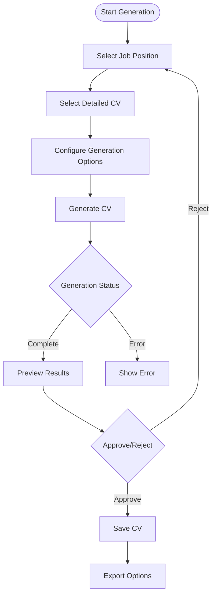

# CV Generation Frontend Implementation Plan

## Current Status Overview

- ✅ Backend is fully prepared with storage models, service layer, and API endpoints
- ✅ Authentication is integrated and protecting endpoints
- ✅ Job catalog and Detailed CV management features are implemented
- ✅ Frontend infrastructure, patterns, and testing strategy are established

## Implementation Architecture

The CV generation frontend will follow our established feature-based organization pattern:

```
features/
  cv-generation/
    components/
      CVGenerationWizard/       # Main generation flow container
      GenerationOptions/        # Generation parameters configuration
      CVPreview/                # Preview components for different formats
      JobCVSelection/           # Selection interface for jobs and CVs
      CVStatusIndicator/        # Visual status tracking
      GeneratedCVList/          # Listing of generated CVs
    hooks/
      useGeneratedCVs.ts        # Data fetching for generated CVs
      useGeneratedCV.ts         # Single CV data management
      useGenerationMutation.ts  # Generation request handler
      useGenerationStatus.ts    # Status polling and tracking
    api/
      generatedCVApi.ts         # API client functions
    utils/
      formatHelpers.ts          # Formatting utilities
    types.ts                    # Type definitions
    constants.ts                # Feature constants
```

## Implementation Steps

### 1. Foundation Setup

1. [ ] Create feature directory structure
2. [ ] Run existing OpenAPI schema type generation script
3. [ ] Implement API client functions
4. [ ] Adapt existing React Query hook patterns for CV generation

### 2. CV Generation Flow UI



#### Implementation Details:

1. **CVGenerationWizard Component**

   - Multi-step wizard interface with clear progression
   - Step validation before proceeding
   - Breadcrumb navigation showing progress
   - Consistent language handling across steps

2. **JobCVSelection Component**

   - Grid/card view of available jobs with filtering
   - CV selection interface with language filtering
   - Preview cards showing key information
   - Selection validation and highlighting

3. **GenerationOptions Component**

   - Parameter controls based on available options
   - Template selection with visual previews
   - Additional notes/customization input
   - Form validation with clear error messages

4. **Generation Status Tracking**
   - Visual indication of generation progress
   - Status polling using `useGenerationStatus` hook
   - Error display with retry options
   - Loading states and animations

### 3. Preview & Editing Components

1. **CVPreview Component**

   - Implementation variants:
     - [ ] Markdown preview with HTML rendering
     - [ ] PDF rendering integration
   - [ ] Responsive design for different screen sizes
   - [ ] Print functionality (if straightforward to implement)

2. **Competency Editing Interface**

   - [ ] Inline editing of generated competencies
   - [ ] Edit core competencies or regenerate full CV
   - [ ] Clear feedback for ongoing operations
   - Note: Drag-and-drop reordering postponed until backend supports ordered lists

3. **Full CV Review Component**
   - [ ] Complete CV preview and approval workflow
   - [ ] Clear display of generated content
   - [ ] "Regenerate Core Competencies" button
   - [ ] "Regenerate Full CV" button

### 4. Document Management

1. **GeneratedCVList Component**

   - [ ] Grid view using existing pattern from jobs/detailed CVs
   - [ ] Sort/filter controls (by date, job, language)
   - [ ] Language filtering consistent with other features
   - [ ] Core actions: view, regenerate, delete

2. **CV Status Management**

   - [ ] Visual status badges (generating, completed, failed)
   - [ ] Appropriate UI states during generation
   - [ ] Clear error states with retry options

3. **Export Interface**

   - [ ] Format selection (PDF, Markdown)
   - [ ] Configuration options for each format
   - [ ] Download handling with progress indication
   - [ ] Error handling for export failures

4. **PDF Preview/Download**
   - [ ] Integration with backend PDF generation
   - [ ] Preview rendering in modal/panel
   - [ ] Download button with format options
   - [ ] Print functionality

### 5. Integration & Testing

1. **Routing Integration**

   - [ ] Add routes for CV generation workflow
   - [ ] Route protection with authentication
   - [ ] URL-based step tracking
   - [ ] Navigation patterns consistent with app

2. **Testing Strategy**

   - [ ] Unit tests for all components
   - [ ] Integration tests for complete workflow
   - [ ] Mock handlers for API endpoints
   - [ ] Headless UI components for accessibility

3. **Error Boundaries**
   - [ ] Implement error boundaries for main components
   - [ ] Create fallback UI for error states
   - [ ] Clear error messaging for users

## Technical Considerations

1. **State Management**

   - [ ] Use React Query for server state (generated CVs, jobs, etc.)
   - [ ] Local state with useState/useReducer for wizard steps
   - [ ] Context for shared generation state if needed

2. **Performance Optimization**

   - [ ] Use backend pagination for lists
   - [ ] Lazy loading of heavy components (PDF preview)
   - [ ] Optimistic UI updates where appropriate

3. **Accessibility**

   - [ ] Use Headless UI components throughout
   - [ ] Ensure keyboard navigation
   - [ ] Screen reader support for status changes

4. **Pattern Consistency**
   - [ ] Follow established form page patterns
   - [ ] Maintain type safety with required props
   - [ ] Consistent error handling approach
   - [ ] Co-located component organization

## Implementation Timeline

Based on complexity, we estimate the following timeline:

1. **Foundation & Basic UI (1-2 weeks)**

   - [ ] Setup feature structure
   - [ ] Implement core hooks and API functions
   - [ ] Build basic wizard flow without refinements

2. **Core Functionality (2-3 weeks)**

   - [ ] Complete generation flow implementation
   - [ ] Add preview components
   - [ ] Implement status tracking
   - [ ] Basic document management

3. **Refinement & Polish (1-2 weeks)**

   - [ ] UX improvements and animations
   - [ ] Advanced editing features
   - [ ] Comprehensive error handling
   - [ ] Performance optimization

4. **Testing & Documentation (1 week)**
   - [ ] Complete test coverage
   - [ ] Documentation updates
   - [ ] Accessibility remediation
   - [ ] Final polishing
